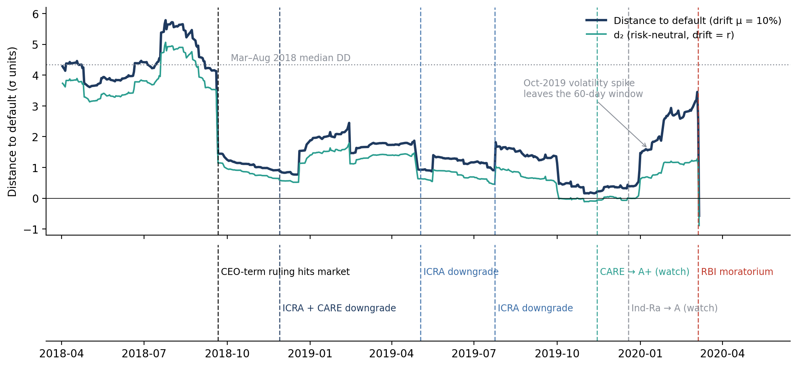

# From Committee to Continuum
### Can markets price default faster than rating agencies?

A structural credit-risk model (Merton / KMV), derived from first principles and tested against a real bank failure. Built for MS37025 (Managing Financial Services and Institutions), Department of Management Studies, NIT Warangal, and written to double as FRM Part 1/2 study material.

**Question:** rating agencies (CRISIL, ICRA, CARE, India Ratings) assess bank default risk periodically, through committee judgement, based on disclosed information. The Merton model instead reads a *distance to default* continuously out of traded equity prices, with no committee involved. Using the Yes Bank crisis (2018–2020) as the test case: did the market-implied signal deteriorate before the agencies downgraded, and before the RBI intervened?

> **Verdict:** the market signal moved first in every downgrade episode — by 3 to 68 days — but it did not time the regulatory intervention itself. On the day before the moratorium, distance to default stood at its highest level since September 2018, because an old volatility spike had rolled out of the measurement window and the bank's worst quarter was still unpublished. Full reasoning, derivation, build log and real-world interpretation are in [`docs/Master_Note_Committee_to_Continuum.pdf`](docs/Master_Note_Committee_to_Continuum.pdf) — a 30-page research write-up, not just a slide deck.



## What's actually in the master note

This isn't just a derivation — it's a full research write-up in five parts:
1. **The theory** — Merton's model built from nothing: lognormal distributions, GBM, Black-Scholes, distance-to-default, KMV's refinements.
2. **The case** — a verified timeline of Yes Bank's collapse, checked against primary sources (RBI letters, agency press releases, and an actual SEBI adjudication order) rather than left as unconfirmed news reports.
3. **The build** — a first-person, chronological walkthrough of the code, with real terminal output quoted and interpreted line by line (not just the final chart).
4. **Real-world interpretation** — what the result actually means for an investor, a bank risk desk, a regulator, and the rating agencies themselves.
5. **Closing** — limitations, a full verification log (what was checked, what changed, what's still open), glossary, bibliography.

One correction worth flagging up front: an earlier draft of this project stated that SEBI had penalised CARE Ratings specifically for delaying Yes Bank's downgrade. Having read SEBI's actual 2023 order, that's not quite right — interference was proven for CARE's handling of **DHFL**; for **Yes Bank specifically**, the same investigation concluded the evidence wasn't sufficient to sustain the charge. The note corrects this and explains why the distinction matters (Section 5.1, "A correction I want to be upfront about").

## Repo layout

```
├── data/         Yes Bank daily closing prices (source: your own download — verify licence before reuse)
├── src/          yes_bank_dd.py (data pipeline) and merton_monte_carlo.py (Monte Carlo check)
├── outputs/      yes_bank_dd_series.csv — the computed DD/PD time series
├── figures/      generated charts (payoff diagram, GBM paths, DD timeline, sensitivity, KMV schematic)
├── slides/       MFSI_Committee_to_Continuum.pptx — 25-slide presentation deck
├── docs/         Master_Note_Committee_to_Continuum.pdf — full write-up, plus its .tex source
└── requirements.txt
```

## Running it

```bash
git clone <this-repo>
cd from-committee-to-continuum
pip install -r requirements.txt

python src/yes_bank_dd.py            # rebuilds outputs/yes_bank_dd_series.csv and a DD chart
python src/merton_monte_carlo.py     # confirms the Monte Carlo estimate converges to the closed form
```

`yes_bank_dd.py` looks for a CSV whose name contains "yes" and "bank" in its own folder, in `../data`, or in the current directory — so it works whether you run it from `src/` in this repo or drop it somewhere else next to your own price file.

## Method, in brief

1. **Equity** = daily close × shares outstanding (231.0 cr, rising to 254.9 cr after the August 2019 QIP).
2. **Default point D** = total liabilities (deposits + borrowings + other), taken from the balance sheet *as published at the time* — not the quarter-end figure, since that's what a market participant could actually see.
3. **Asset value V and asset volatility σ_V** are not observable, so they're solved from two simultaneous equations linking them to observed equity value and equity volatility (see `src/yes_bank_dd.py::solve_V_sV`).
4. **Distance to default**: DD = [ln(V/D) + (μ − σ²/2)·T] / (σ√T), computed daily from a 60-day trailing equity-volatility window.
5. Robustness checked against seven variants of the rate, drift, volatility window and default-point assumptions — the *timing* of the warnings is stable; the *level* of DD is not.

## Data sources and caveats

- Yes Bank daily closing prices: your own exchange/vendor download (`data/Yes_Bank_Stock_Price_History.csv`). Check the data provider's terms before redistributing this file publicly.
- Balance-sheet figures and rating-action dates are drawn from Yes Bank's own press releases, agency press releases, and — for the CARE/SEBI matter — SEBI's own published order. The master note's closing section (13, "What I verified, what changed, and what I still could not confirm") lists exactly what's been confirmed to a primary source and what remains a modelling assumption.
- This is coursework analysis, not investment research, and none of it should be read as advice on any security.

## License

MIT — see [LICENSE](LICENSE). The Yes Bank price data itself may carry separate terms from its original source; the code and written analysis are MIT-licensed.

## Author

Dhritabrata Swarnakar (Roll No. 25MSG1R16) — MBA, Department of Management Studies, NIT Warangal
